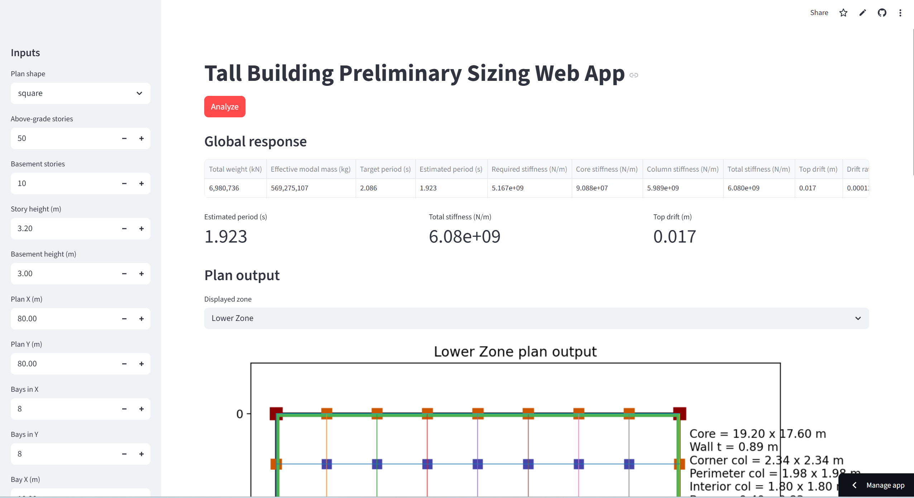
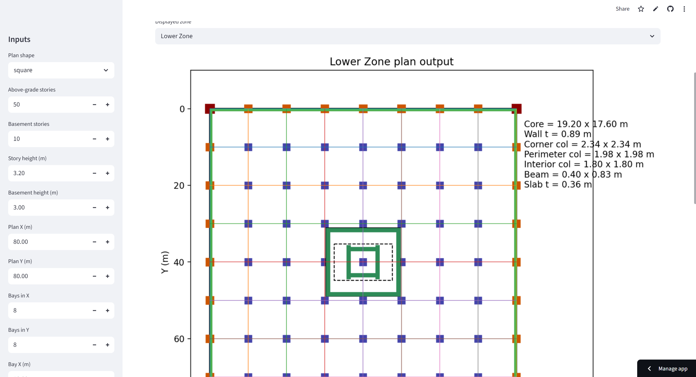
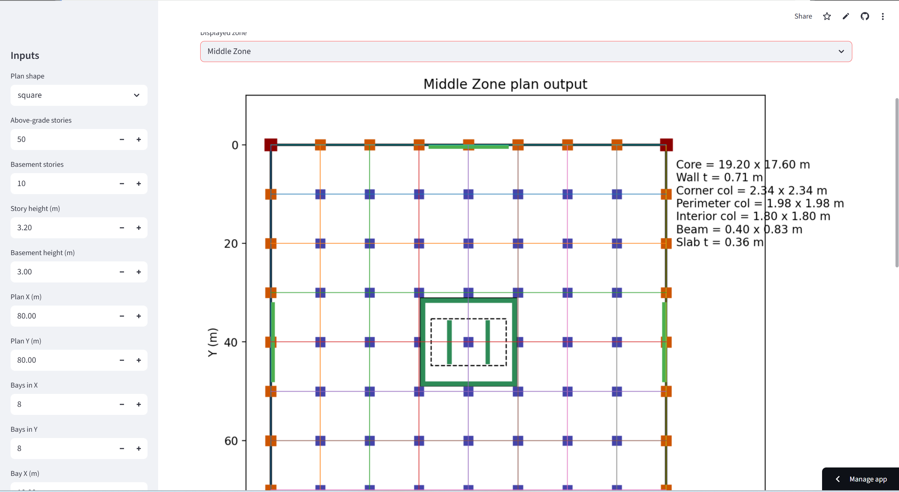
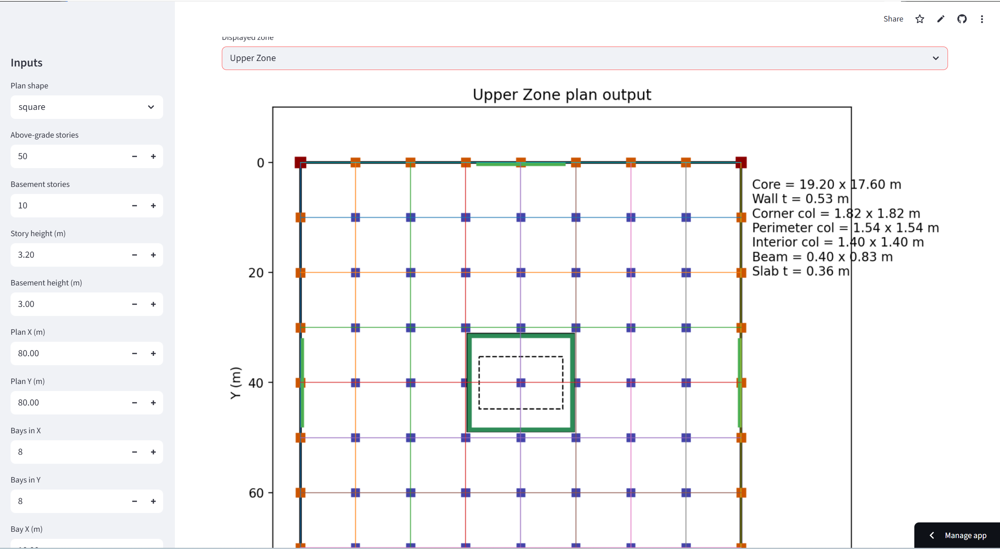

# 🏗️ Tall Building Preliminary Sizing Web App
Preliminary Sizing of Tall Buildings with Dual Structural System

The structural system is initially idealized as an equivalent single-degree-of-freedom (SDOF) model for rapid preliminary estimation of the fundamental period based on global mass and stiffness:

$$
M \ddot{u}(t) + K\,u(t) = 0
$$

$$
T = 2\pi \sqrt{\frac{M}{K}}
$$

where $M$ is the effective modal mass and $K$ is the equivalent lateral stiffness of the system.

For improved accuracy, the model is subsequently refined using a multi-degree-of-freedom (MDOF) representation:

$$
[M]\{\ddot{u}\} + [K]\{u\} = 0
$$

$$
[K]\{\phi\} = \omega^2 [M]\{\phi}
$$

For each mode, the natural period is given by $T_i = \frac{2\pi}{\omega_i}$.

Designing tall buildings requires an efficient balance between strength, stiffness, and constructability. One of the most widely used structural systems for high-rise buildings is the reinforced-concrete dual system, which combines:

Central core walls (shear wall core)
Perimeter moment-resisting frames
Additional distributed shear walls (if required)

This hybrid configuration provides both lateral stiffness and structural redundancy, making it suitable for seismic and wind-resistant design.
A graphical web-based tool for **preliminary structural design of tall reinforced-concrete buildings**.

---

## 🚀 Live Application

👉 **Run the app here:**
https://tall-building-preliminary-sizing-app-app-abhc5x7atqzqww8csvjus.streamlit.app/

---

## 📌 Overview

This application provides a **conceptual design framework** for tall buildings using:

* Central **core wall system**
* Distributed **perimeter shear walls**
* **Directional column sizing** for rectangular plans
* Preliminary **stiffness-based structural estimation**

The tool estimates:

* Structural stiffness (K)
* Fundamental period (T)
* Drift
* Member dimensions (columns, walls, beams, slab)

---

## 🧠 Engineering Concept

The fundamental period is estimated using:

T = 2π √(M / K)

Where:

* M = effective modal mass
* K = lateral stiffness of the system

---

## 🖥️ Features

* Interactive web interface (Streamlit)
* Square and triangular plan layouts
* Automatic core sizing
* Perimeter wall distribution
* Directional column design (bx × by)
* Graphical plan output
* Zone-based structural evaluation

---

## 📊 Inputs

The model requires:

* Building geometry (height, plan size)
* Grid system (bay spacing)
* Material properties (fck, Ec, fy)
* Loads (DL, LL)
* Structural configuration parameters

---

## 📈 Outputs

The program generates:

* Total structural weight
* Effective modal mass
* Target vs estimated period
* Required vs estimated stiffness
* Drift and drift ratio
* Beam and slab dimensions
* Column sizes (directional)
* Core wall geometry
* Graphical plan layout

---

## ⚠️ Important Note

This tool is intended for:

✔ Preliminary design
✔ Concept development

It is **NOT** a substitute for:

* ETABS / SAP2000 analysis
* Seismic design
* Final structural design

---

## 📷 Example Outputs

### 🔹 Global Structural Response



This section shows:

* Total structural weight
* Estimated vs target period
* Global stiffness (K)
* Drift

---

### 🔹 Lower Zone (High stiffness zone)


* Thick core walls
* Perimeter retaining walls
* Maximum column dimensions

---

### 🔹 Middle Zone (Transition behavior)


* Reduced wall thickness
* Optimized column sizes
* Partial perimeter wall distribution

---

### 🔹 Upper Zone (Flexible region)



* Minimum wall thickness
* Reduced structural demand
* More efficient material usage

---


## ⚙️ Run Locally

```bash
pip install -r requirements.txt
streamlit run streamlit_app.py
```

---

## 👨‍💻 Author

Benyamin Razaziyan
PhD Student – Structural Engineering
